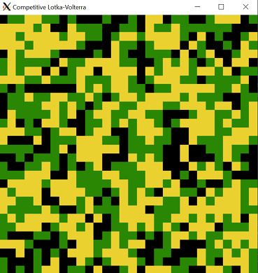
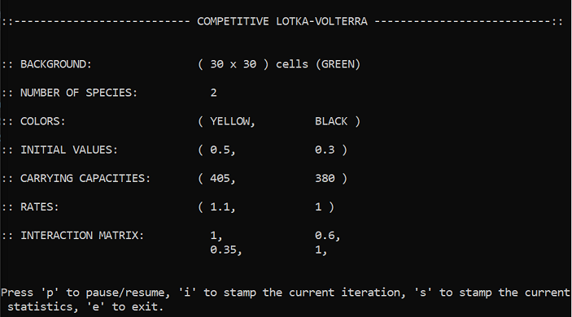
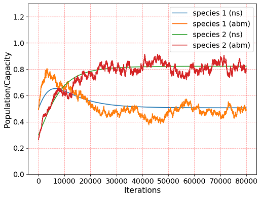
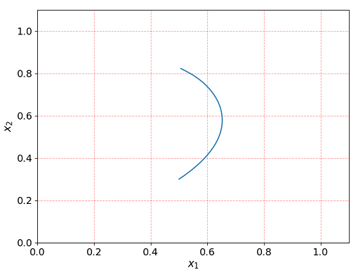
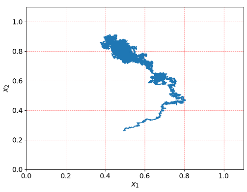

# Competitive Lotka-Volterra 
[](https://www.codacy.com/gh/tommasomarzi/Competitive-Lotka-Volterra/dashboard?utm_source=github.com&amp;utm_medium=referral&amp;utm_content=tommasomarzi/Competitive-Lotka-Volterra&amp;utm_campaign=Badge_Grade)

The aim of this project is to calibrate an Agent-Based model representing a competitive N-species Lotka-Volterra model with its numerical solution.

Jump to a section:
*   [Theoretical model](#The-theoretical-model)
*   [Agent-Based model](#The-Agent-Based-model)
*   [Structure of the code](#Structure-of-the-code)
*   [Requirements](#Requirements)
*   [Usage](#Usage)
*   [Testing](#Testing)
*   [Documentation](#Documentation)

## The theoretical model
The model describes the evolution of N species competing for the same resources.
In particular, the evolution of each species *i* normalized with respect to its own carrying capacity is described by the following first-order nonlinear differential equation:

<p>
<CENTER>

</CENTER>
</p>

where *r<sub>i</sub>* > 0 is the growth rate of the species *i* and *&alpha;<sub>ij</sub>* >= 0 is the element of the interaction matrix *&alpha;* which quantifies the effect of the species *j* on the species *i* (conventionally *&alpha;<sub>ii</sub>* = 1).
The evolution of each species is bounded between 0 and 1 with respect to its own carrying capacity.

For references regarding the chaotic dynamics or attractor phenomena that this model can exhibit, check the [Wikipedia page](https://en.wikipedia.org/wiki/Competitive_Lotka%E2%80%93Volterra_equations#Possible_dynamics).

This model is numerically solved by using the [Runge-Kutta 4 algorithm](https://en.wikipedia.org/wiki/Runge%E2%80%93Kutta_methods#The_Runge%E2%80%93Kutta_method), which allows to solve a general ordinary differential equation with known initial conditions ***x***( t<sub>0</sub> ) in the form:

<p>
<CENTER>

</CENTER>
</p>

In particular, the solution for a time increment *h* is:

<p>
<CENTER>

</CENTER>
</p>

where we introduced four auxiliary fields ***F<sub>1,2,3,4</sub>*** defined as:

<p>
<CENTER>

</CENTER>
</p>

## The Agent-Based model
An Agent-Based model is realized by considering a *n* x *n* grid in which the individuals move and interact according to stochastic events based on the values of the parameters of the model. The rules are the following:

1.  at the beginning, each cell of the grid is initialized with an individual belonging to a species *i* with a probability:

    <p align="center">
    <CENTER>
    
    </CENTER>
    </p>

    where *K<sub>i</sub>* is the carrying capacity of the species *i* (i.e. maximum number that the population can reach).

2.  then for each iteration we pick a cell:
    *   if it is empty, an individual of a certain species is created with a probability given by:

        <p align="center">
        <CENTER>
        
        </CENTER>
        </p>

        where *g<sub>i</sub>* is the occupation number in the eight-cells neighborhood and *Z* is a normalization constant (the rate associated to the empty cells *r<sub>0</sub>* is fixed to one and it leaves the cell unoccupied).

    *   if it is occupied, it interact with one kind of the neighborhood cells according to the occupation number:

        <p align="center">
        <CENTER>
        
        </CENTER>
        </p>

        If *j* = 1, ..., N then the individual in the considered cell dies with a probability *&alpha;<sub>ij</sub>*. Therefore, we require that *&alpha;<sub>ij</sub>* <= 1.
        If *j* = 0 then the individual can move to an empty cell (or it stays in the current one) with a uniform probability. If the parameter ENABLE_BIRTHS in the [setup.h](https://github.com/tommasomarzi/Competitive-Lotka-Volterra/blob/master/utilities/setup.h) is set to true, the individual has the opportunity to generate another individual in an empty cell with a probability:

        <p align="center">
        <CENTER>
        
        </CENTER>
        </p>

        If this event does not occur, the individual can move according to an uniform probability.

The simulation evolves up to the chosen number of iterations (check the [setup_usage](https://github.com/tommasomarzi/Competitive-Lotka-Volterra/blob/master/docs/setup_usage.md) file).

## Structure of the code
The code is structured in the following folders:
*   [agent_based_model](https://github.com/tommasomarzi/Competitive-Lotka-Volterra/tree/master/agent_based_model): in this folder three blocks of files are present, i.e. main_abm.cpp, which handles the glutMainLoop (if the graphical part is enabled), graphics.cpp/h in which the rules concerning the graphical part are defined, and LV.cpp/h, in which the dynamics of the agent-based model is specified.
*   [data](https://github.com/tommasomarzi/Competitive-Lotka-Volterra/tree/master/data): this folder contains some examples of data regarding the dynamics of the model (growth rates in rates.txt, initial conditions in values.txt, interaction matrix in matrix.txt and carrying capacities in capacity.txt) with different number of species. It is possible to add new configuration files following this format.
*   [docs](https://github.com/tommasomarzi/Competitive-Lotka-Volterra/tree/master/docs): this folder contains the setup_usage.md file, which is a markdown file that explains the usage of the parameters in the setup.h file, and a folder with a configuration file for the doxygen documentation. In particular, if this latter is realized a new folder containing the documentation files named html will be created.
*   [numerical_simulation](https://github.com/tommasomarzi/Competitive-Lotka-Volterra/tree/master/numerical_simulation): in this folder the numerical solution of the competitive Lotka-Volterra model is computed through the RK4 algorithm. In particular, main_ns.cpp handles the main loop and it calls the algorithm and the model that are present in lotka_volterra.cpp/h files.
*   [output](https://github.com/tommasomarzi/Competitive-Lotka-Volterra/tree/master/output): this folder will contain the plots if SAVE_PLOT in utilies.h is set to true.
*   [testing](https://github.com/tommasomarzi/Competitive-Lotka-Volterra/tree/master/testing): in this folder the main functions of the program are tested using the [Catch2](https://github.com/catchorg/Catch2/tree/v2.x) framework.
*   [utilites](https://github.com/tommasomarzi/Competitive-Lotka-Volterra/tree/master/utilities): this folder contains several files that are required both for the numerical simulation and the agent-based model. In particular, we distinguish the reader.cpp/h files, in which the functions to read the data from file are defined, plotter.py, which handles the visualization of the trends, and utilities.h, which contains the parameters for the simulation.

## Requirements
### C++
The C++ version required is the C++11 standard.

The graphical part of the agent-based model is made with [OpenGL](https://www.opengl.org//) using the [FreeGlut library](http://freeglut.sourceforge.net/). 
To install it, type (Ubuntu or Debian Linux):
```bash
sudo apt-get install freeglut3 freeglut3-dev
```
To install the [GNU binutils](https://www.gnu.org/software/binutils/) tools, type:
```bash
sudo apt-get install binutils-gold
```

### Python
At the moment to run the program the python3 version is required.
For the python script the following libraries are required:

*   numpy
*   matplotlib 

If they are not already installed, type:
```bash
pip3 install numpy>=1.20.0 matplotlib>=3.3.4
```

## Usage
Clone the repository:
```bash
git clone https://github.com/tommasomarzi/Competitive-Lotka-Volterra.git
```
Then type:
```bash
cd Competitive-Lotka-Volterra 
```

### Run the model
Once the configuration in the [setup.h](https://github.com/tommasomarzi/Competitive-Lotka-Volterra/blob/master/utilities/setup.h) file has been chosen (**please refer to the [setup_usage](https://github.com/tommasomarzi/Competitive-Lotka-Volterra/blob/master/docs/setup_usage.md) file**), in order to build and run the simulation type (the flag '-s' silences the output of make, but it is not strictly necessary):
```bash
make model -s
```
Once the simulation has been performed, the output files of the two models can be found in the folder with the parameters chosen in setup.h. If the variable ENABLE_PLOT has not been set to true, you can realize the plots from those files once the simulation is finished by typing:
```bash
/usr/bin/python3 utilities/plotter.py
```
Otherwise, if ENABLE_PLOT is set to true the plots will be realized automatically.

### Example
Once the simulation has been run, if ENABLE_GRAPHICS is set to true the evolution of the grid will be shown on screen as follows:



in which the green cells represent the empty cells, while the yellow and the black cells represent the two species. These informations are shown on the shell as well as the chosen parameters and the help menu:



If ENABLE_GRAPHICS is set to false, only the chosen configuration will appear on the shell.

In the presented case, the simulation is performed with the parameters reported in the [2-species_example](https://github.com/tommasomarzi/Competitive-Lotka-Volterra/blob/master/data/2-species_example) folder with an increment *h*=0.0003 and ENABLE_BIRTHS set to false. The simulation evolves up to 80000 iteration.
The comparison of the trends of the two populations shows good agreement between the theoretical model and the agent-based model:



In the numerical simulation, in the case of two species the system tends to a stable fixed point which can be easily computed by imposing the time-derivative of the species equal to zero. Therefore, the trajectory in the two-species plane tends to that fixed point:



On the other hand, the spatial information and the inner stochasticity of the agent-based model do not allow an exact stabilization of the populations. As a matter of fact, in this case the trajectory in the two-species plane follows a trend which deviates randomly from the one of the numerical solution and it ends up to fluctuate around the fixed point, creating a cloud:



## Testing
The testing is performed with the [Catch2](https://github.com/catchorg/Catch2/tree/v2.x) framework: you do not have to install anything since it is a [single-header file](https://github.com/tommasomarzi/Competitive-Lotka-Volterra/blob/master/testing/catch.hpp) that is already present in the [testing folder](https://github.com/tommasomarzi/Competitive-Lotka-Volterra/tree/master/testing) to avoid path conflicts.

The testing can be done by typing (the flag '-s' silences the output of make, but it is not strictly necessary):
```bash
make test -s
```
**WARNING**: before starting the testing please set the DEBUG_MODE variable in the [setup.h](https://github.com/tommasomarzi/Competitive-Lotka-Volterra/blob/master/utilities/setup.h) file to true in order to fix the seed of the sequence of random numbers and ensure the reproducibility of the results of the agent-based model test (a seed cannot be set specifically for the test as it would conflict with that of the model).
Otherwise, the tests will still be performed and a warning message will appear on the shell.

## Documentation
The documentation can be realized with [doxygen](https://www.doxygen.nl/index.html). 
As [this issue](https://github.com/doxygen/doxygen/issues/4851) explains, in the doxygen versions before the 1.8.3 there are problems with the TOC page which lead to an incorrect hierarchy of headers.
Therefore you should install one of the latest versions of doxygen by following this [guide](https://www.doxygen.nl/manual/install.html).
However, since these problems are layout problems and they do not change the content of the documentation, you can install the version 1.8.17 by simply typing (Ubuntu or Debian Linux):
```bash
sudo apt-get install doxygen
```
which will also avoid problems related to possible missing GNU tools as flex, bison and libiconv.
In this case, please remember that the TOC page will not be displayed correctly.

In order to create the html documentation file, from the Competitive-Lotka-Volterra folder type:
```bash
doxygen docs/doxygen/Doxyfile
```
After some processing time, a folder named html which contains a bunch of files will be created in docs/: the documentation can be viewed in the file index.html and you can open it in your browser directly from the shell by typing (in my case I'm using firefox):
```bash
firefox docs/html/index.html 
```
The testing folder is excluded from the doxygen documentation (simple docstrings are present in the code).